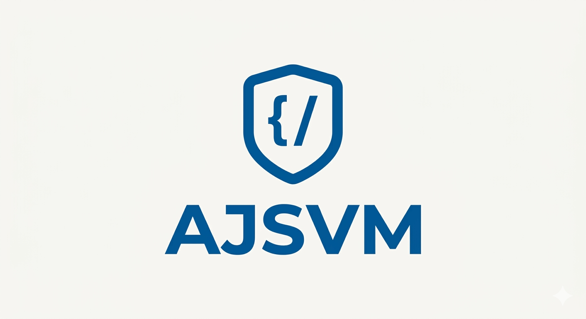

<div align="center">
  
</div>

# AJSVM - Java Script Virtual Machine

Welcome to **AJSVM**! This is a custom, stack-based virtual machine built entirely from scratch in TypeScript to execute JavaScript. 

But why build another JS engine when we already have V8? The answer is simple: **Source Code Protection**. 

Standard JavaScript obfuscators just scramble your variables and strings, which can often be easily de-obfuscated or reverse-engineered by experienced attackers. AJSVM takes a different approach. It compiles your plain JS code into a proprietary, highly randomized bytecode, and bundles it together with a customized VM, it creates a massive headache for anyone trying to steal or reverse your logic

---

## ⚙️ Architecture

The project is split into several logical parts that work together to parse, compile, and execute your code:

- **Parser (`parser/parser.ts`)**
  Relies on the reliable `acorn` library to parse your raw JS code into an AST (Abstract Syntax Tree).
  
- **Compiler (`compiler/compiler.ts` & `ast/visitors/*`)**
  The heart of the translation process. It walks through the AST and emits our custom bytecode. To make reverse-engineering even harder, the compiler randomizes the opcode mapping on every build, encrypts strings, and even inserts fake instructions (dummy blocks) to break static analysis.

- **Custom Heap & GC (`vm/heap.ts`)**
  It handles memory allocation for objects, arrays, and closures using a custom DataView buffer. It even has its own Mark-and-Sweep Garbage Collector to prevent memory leaks during execution.

- **The VM Engine (`vm/vm.ts` & `vm/closure-handler.ts`)**
  The execution core. It runs the main loop, decodes the bytecode, and executes instructions on a custom call stack. It bridges the gap between our isolated environment and the native Node.js/Browser world using an Interop Handler.

- **MicroVM Builder (`micro.vm.builder.ts`)**
  The packer. It takes the engine, tree-shakes unused opcodes, injects your encrypted bytecode, obfuscates VM internals, and spits out a single, standalone `.js` file that you can deploy anywhere.

---

## 🚀 How to use

Currently, the easiest way to interact with AJSVM is via the CLI provided in `index.js` (compiled from `index.ts`).
### 1. Install node_modules
To run project you need to install modules. Open project folder and run command:
```bash
npm install
```
### 2. Compile and Protect your code
To compile your source file and generate a protected output file:

```bash
node index.js --in="path/to/your/input.js" --out="path/to/protected/output.js"
```
*This will parse your code, compile it to bytecode, bundle it with the VM engine, and save a highly compressed and obfuscated file*

### 3. Test run directly
If you just want to run a file through the VM immediately to see the output without generating a build:

```bash
node index.js --in="path/to/your/input.js"
```

### 4. Run default example
Running the script without any arguments will compile and execute a simple "Hello, world!" example:

```bash
node index.js
```

---

## 💡 Roadmap

The first version is nearly done, here is what coming next:

### Classes & Objects
- [ ] **Instance Properties** (Support for class instance fields)
- [ ] **Computed method names** (e.g., `dynamicName {}`)
- [ ] **Computed method calls** (e.g., `objmethod`)
- [ ] **Class Expressions** (e.g., `const A = class {}`)

### Control Flow & Exceptions
- [ ] **`try...finally`** blocks (Currently only `try...catch` is supported)
- [ ] **Labels** (`break label; continue label;`)
- [ ] **Catch Destructuring** (e.g., `catch ({ message })`)
- [ ] **Generator Delegators** (`yield*` expressions)

### Variables & Environment
- [ ] **Constants anti-changing** (Throw errors when trying to reassign `const` variables)
- [ ] **LHS in Loops** (Complex assignment patterns in `for...in`/`for...of` loops)

### Operators & Expressions
- [ ] **Logical compound assignments** (`??=`, `||=`, `&&=` for MemberExpressions)
- [ ] **Tagged Template Literals** (e.g., `styled\`Hello \${name}\``)
- [ ] **`with` statement** (Legacy, but good for full compatibility)

### Architecture & Core
- [ ] **Native BigInt & Symbol in CustomHeap**: Currently they rely on external references. Moving them natively into the heap with specific tags will boost performance and isolation.
- [ ] **Prototype Chain for simple objects**: Better prototype linking for objects created via `MAKE_OBJECT`.
- [ ] **ESM Realization**: Support for AST nodes `ImportDeclaration` / `ExportNamedDeclaration` for modular execution.

---

*Created to push the boundaries of JS virtualization and code security.*
